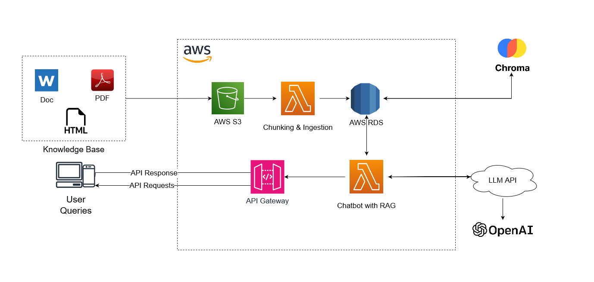

# RAG Chatbot Application with AWS

This project demonstrates how to build a Retrieval-Augmented Generation (RAG) chatbot application using AWS services. The application consists of two AWS Lambda functions:

1. **Ingestion Lambda**: Handles file uploads, processes PDF and DOC files, splits them into chunks, and stores them in ChromaDB.
2. ** Chatbot Lambda**: Handles user queries, retrieves relevant chunks from ChromaDB, and generates responses using an LLM (e.g., OpenAI GPT-3).

## Architecture



The architecture involves the following AWS services:
- **Amazon S3**: Stores PDF and DOC files.
- **AWS Lambda**: Executes the backend logic.
- **Amazon API Gateway**: Exposes the query handling endpoint.
- **ChromaDB**: Vector database to store and retrieve document chunks.
- **OpenAI API**: Generates responses using a language model.

## Prerequisites

- AWS account
- Python 3.x
- AWS CLI
- OpenAI API key

## Setup

### Step 1: Ingestion Lambda

1. **Create a Lambda Function**

    ```bash
    aws lambda create-function \
        --function-name Ingestion \
        --runtime python3.8 \
        --role <IAM_ROLE_ARN> \
        --handler lambda_fn.ingestion.src.app.lambda_handler \
        --zip-file fileb://package.zip
    ```

2. **Set Up S3 Trigger**

    - Go to the S3 bucket and create an event notification to trigger the Lambda function on object creation.


### Step 2: Chatbot Lambda

1. **Create a Lambda Function**

    ```bash
    aws lambda create-function \
        --function-name vhatbot \
        --runtime python3.8 \
        --role <IAM_ROLE_ARN> \
        --handler lambda_fn.chatbot.src.app.lambda_handler \
        --zip-file fileb://package.zip
    ```

2. **Set Up API Gateway**

    - Create a new REST API in API Gateway.
    - Create a new resource `/query` and a POST method.
    - Integrate the POST method with the QueryHandlingLambda function.
    - Deploy the API to a stage (e.g., `dev`).


## Deployment

1. **Package Dependencies**

    ```bash
    python3 -m venv venv
    source venv/bin/activate
    pip install boto3 fitz PyMuPDF python-docx sentence-transformers chromadb openai
    cd venv/lib/python3.*/site-packages
    zip -r9 ${OLDPWD}/package.zip .
    cd $OLDPWD
    zip -g package.zip lambda_fn.py
    ```

2. **Upload to Lambda**

    - Upload the `package.zip` file for both Lambda functions using the AWS Lambda Console.

## Testing

1. **Upload Files**

    - Upload PDF and DOCX files to the S3 bucket.

2. **Invoke API**

    - Send a POST request to the API Gateway endpoint with a JSON body containing a query. For example:

    ```json
    {
      "query": "What is the process for handling user queries in AWS Lambda?"
    }
    ```

3. **Check Responses**

    - Verify that the responses are relevant and correctly generated by the LLM.

## Notes

- Ensure your ChromaDB instance is accessible from your Lambda functions.
- Adjust the chunk size and other parameters as needed based on your specific use case.

 